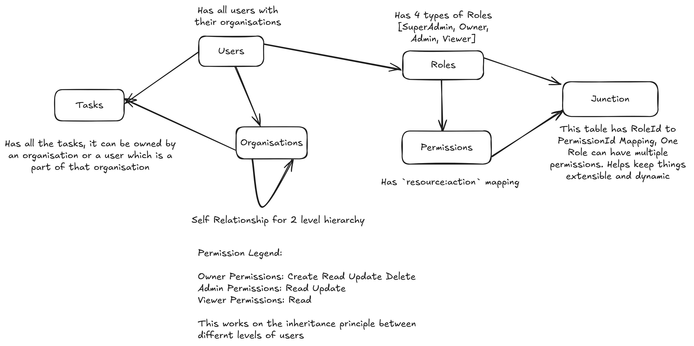

# Turbovets Submissions

## Made with NX Monorepo Workspace

### Steps to Run the Code

- Clone the repository onto your machine
- `cd turbovets-submission`
- Run Commane `npm install --legacy-peer-deps` , this will install all the necessary dependencies
- You can run postgres in a docker container, steps can be found [here](https://hub.docker.com/_/postgres).
- Once you have postgres up and running, create a database named `turbovets`
- After that run the command, `nx run api:migration:run` to create all the necessary tables to run the code
- Now you can serve the apps
  - `nx serve api --configuration=development`
  - `nx serve task-dashboard`
- You can access the API Docs (Swagger Documentation) `http://localhost:3000/api-docs/`
- You can access the Backend on `localhost:3000`
- You can access the Frontend on `localhost:4200`

## Rough ER Diagram

### Scope of Improvement

- Logging
- Implementation of Frontend beyond User Screen (Was needed to implement creation of task and ownership)
- Adding test cases
- Better UI in frontend
- Error handling in frontend, with more verbose errors in the backend
- Increased granular guards in the frontend.
- Moving from `localstorage` to a central state management such as `NgRx`.
